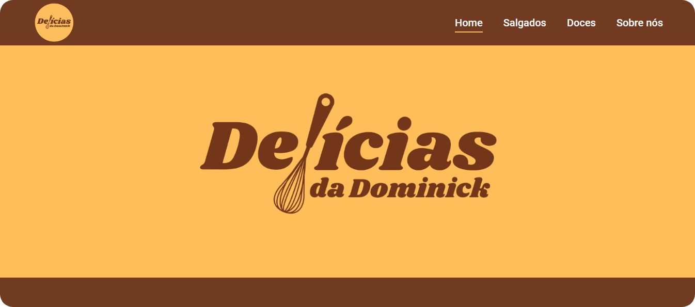

# Projeto Delícias da Dominick
Este repositório contém o código-fonte do projeto final do curso "Descodificadas". O projeto consiste em um site para uma loja de doces e salgados, inspirado na "Delícias da Dominick", que será desenvolvido gradualmente ao longo dos módulos do curso.

 

## 📌 Índice

- [Layout](#️-layout)
- [Objetivo](#objetivo)
- [Tecnologias e Ferramenta utilizadas](#tecnologias-e-ferramenta-utilizadas)
- [Autor](#-autor)

 

## 🖥️ Layout

Você pode visualizar o layout do projeto abaixo: 

 

## Objetivo
Criar um site funcional e atrativo para uma loja de doces e salgados, com a aplicação dos conhecimentos adquiridos em cada módulo do curso, buscando inspiração na estética e na proposta da "Delicias da Dominick".

## Tecnologias e Ferramenta utilizadas

   

## 📝 Autor

- Isabela Maria Leonardo