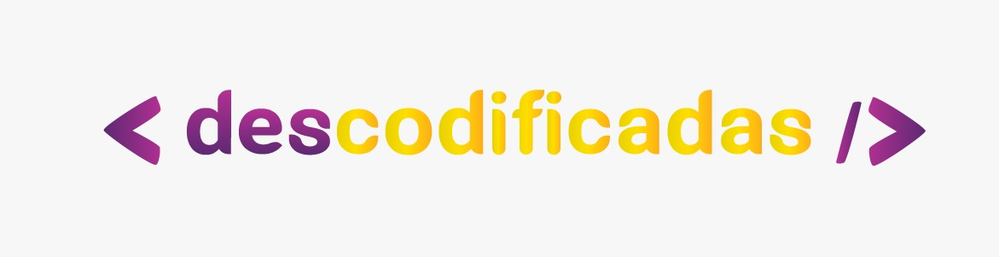

###

# Curso Descodificadas

🚧 Em desenvolvimento
 
 

Este repositório armazena os exercícios do curso Descodificadas, programa de formação em desenvolvimento web para mulheres cis e pessoas trans. Aqui você encontrará os códigos que desenvolvi para completar cada desafio, visando o aprimoramento das minhas habilidades em programação web.

 

## 📌 Índice

- [Estrutura do curso](#estrutura-do-curso)
- [Estrutura do Repositório](#estrutura-do-repositório)
- [Tecnologias e Ferramenta utilizadas](#tecnologias-e-ferramenta-utilizadas)
- [Autor](#-autor)

 

## Estrutura do curso

O Programa Descodificadas é um curso de longa duração projetado para capacitar mulheres no campo da tecnologia. 

O curso é dividido em 4 trilhas de aprendizagem, cada uma com duração de 6 meses. Cada trilha aborda um tema específico da programação web, desde os conceitos básicos até a construção de aplicações completas.

 

Trilhas:
1. Descobrindo o caminho para a programação web
2. Avançando no caminho para a programação web
3. Construindo e integrando aplicações de Front-end
4. Construindo e integrando aplicações de Back-end

 

## Estrutura do Repositório
Este repositório está organizado por trilhas de aprendizagem, onde você encontrará pastas correspondentes a cada uma das trilhas mencionadas acima. Dentro de cada pasta, estarão os exercícios realizados de acordo com os tópicos abordados em cada fase do curso.

## Tecnologias e Ferramenta utilizadas

   

## 📝 Autor

- Isabela Maria Leonardo