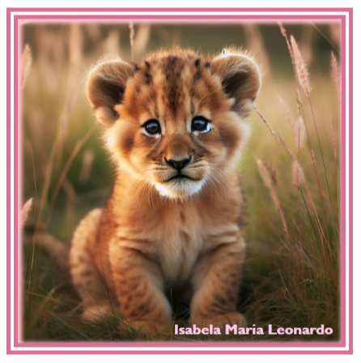

# Exercício Obra de arte

Este exercício consiste em um site simples que reproduz uma imagem em um quadro usando as configurações de Box Model. O objetivo é desenvolver habilidades na utilização do Box Model para controlar o layout e a aparência da página, além de explorar a criatividade na composição do quadro, utilizando borda, margem, imagem, e texto.

 

## 📌 Índice

- [Layout](#-layout)
- [Tecnologias e Ferramenta utilizadas](#tecnologias-e-ferramenta-utilizadas)
- [Autor](#-autor)

 

## 🖥️ Layout

Você pode visualizar o layout do projeto abaixo: 

 

## Tecnologias e Ferramenta utilizadas

   

## 📝 Autor

- Isabela Maria Leonardo