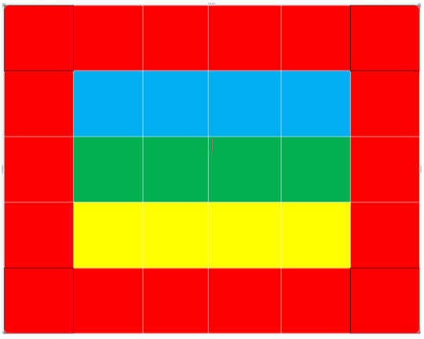

# Exercício Quadrados Coloridos

Este exercício consiste em um site simples que apresenta uma grade de quadrados coloridos. Cada quadrado é representado por uma tag HTML div e utiliza classes e IDs para estilizar e interagir com os elementos. Os quadrados dos cantos possuem uma borda mais escura e alteram sua cor quando o mouse passa sobre eles, utilizando a pseudo-classe :hover.

## 📌 Índice

- [Layout](#-layout)
- [Tecnologias e Ferramenta utilizadas](#tecnologias-e-ferramenta-utilizadas)
- [Autor](#-autor)

## 🖥️ Layout

Você pode visualizar o layout do projeto abaixo: 

## Tecnologias e Ferramenta utilizadas

   

## 📝 Autor

- Isabela Maria Leonardo